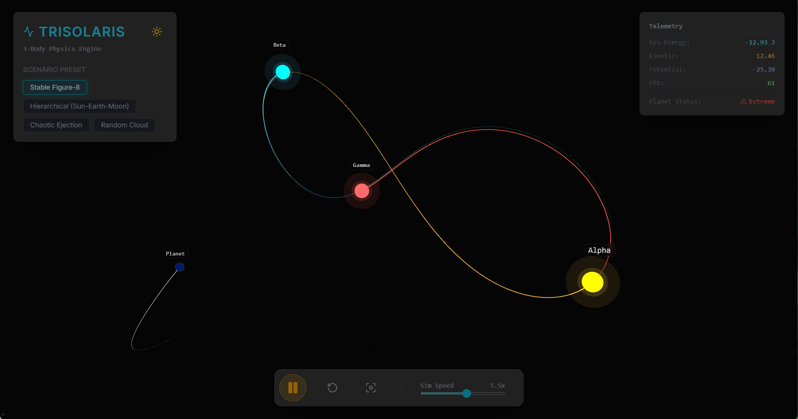
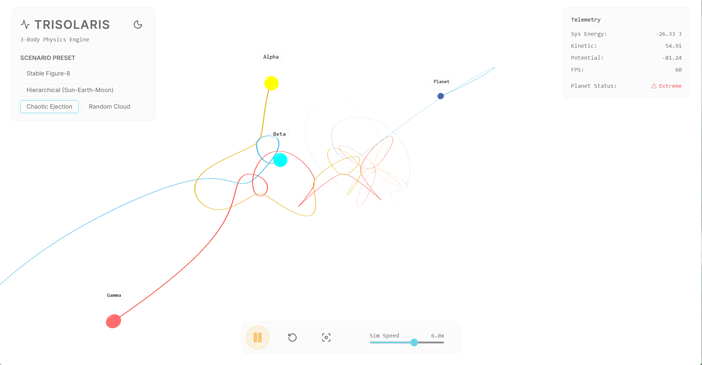

# Three-Body Star System – 交互式三体天体模拟器

Three-Body Star System is a real-time interactive three-body celestial simulator built with Vite, React, and Three.js, featuring preset scenarios, adjustable simulation speed, trajectory trails, telemetry stats, and theme/camera controls to visualize stable and chaotic orbital dynamics.  Any suggestions email me 8515500+gh@gmail.com

Three-Body Star System 是一个基于 Vite + React + Three.js 的实时三体天体模拟与可视化演示项目，提供多种预设场景、速度调节、轨迹渲染、遥测面板与主题/相机控制，让用户直观体验三体系统的稳定与混沌演化。





---


如果你只想快速运行：

- 安装依赖: `npm install`
- 开发模式: `npm run dev`（默认端口 3000）
- 生产构建: `npm run build`
- 本地预览构建: `npm run preview`

本项目为纯静态前端应用，无需任何 API Key 或后端服务。

---

## 功能亮点

- 物理引擎
  - 归一化万有引力常数 G，稳定步长积分
  - 多步进/帧以在高倍速下保持稳定
  - 能量统计与“可宜居”状态粗略判定
- 交互与可视化
  - 预设场景：Figure-8、Hierarchical、Chaotic Ejection、Random
  - 轨迹 Trail（根据速度自适应长度），星空粒子背景
  - Telemetry 面板：系统总能量、动能、势能、FPS、Habitable 指示


---

## 系统要求

- Node.js 18+（推荐使用 LTS）
- 现代浏览器（需开启硬件加速，支持 WebGL）

---

## 本地开发与运行

1) 安装依赖

```bash
npm install
```

2) 启动开发服务器（热更新）

```bash
npm run dev
```

- 默认监听: http://localhost:3000 （若 3000 被占用，Vite 会自动切换到可用端口）
- 终端按 `o` 可自动打开浏览器
- 局域网访问: 已配置 `host: 0.0.0.0`

3) 生产构建

```bash
npm run build
```

- 产物输出至 `dist/`

4) 本地预览构建

```bash
npm run preview
```

---

## 生产部署

这是一个静态 Vite 应用，部署时将 `dist/` 目录上传至任意静态托管服务即可。

---

## 预设场景说明

- Stable Figure-8：三体形成近似“8”字稳定结构，附带一颗行星
- Hierarchical（层级轨道）：类似 Sun-Earth-Moon 的层级系统
- Chaotic Ejection：混沌初始状态，可能出现弹射事件
- Random Cloud：每次随机生成，带最小距离约束，便于观察多样交互

可以在 `constants.ts` 中查看/修改预设参数与随机场景生成策略。

---

---

## 常见问题（FAQ）

- 启动后是空白页？
  - 请确认浏览器已开启硬件加速，且支持 WebGL。
  - 检查控制台是否有报错（依赖是否完整安装）。
- 端口被占用？
  - Vite 会自动选择下一个可用端口；或修改 `vite.config.ts` 的 `server.port`。
- 帧率较低？
  - 降低“Sim Speed”或切换到 `Figure-8` 预设；参考性能文档进一步优化。

---

## 参与贡献

欢迎通过 Issue/PR 参与改进：
- 修复 Bug 或优化性能
- 改善可视效果与交互细节
- 增加新的预设场景/可配置项

如需帮助，可在仓库中提交 Issue。祝玩得开心！
